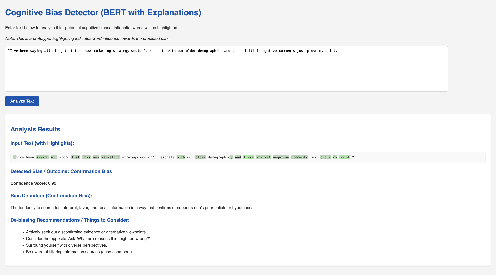
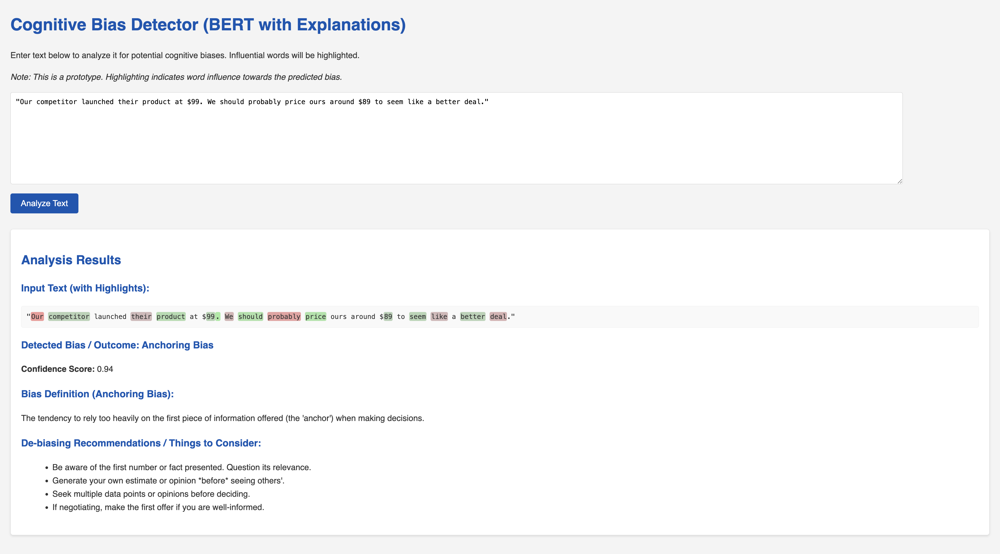
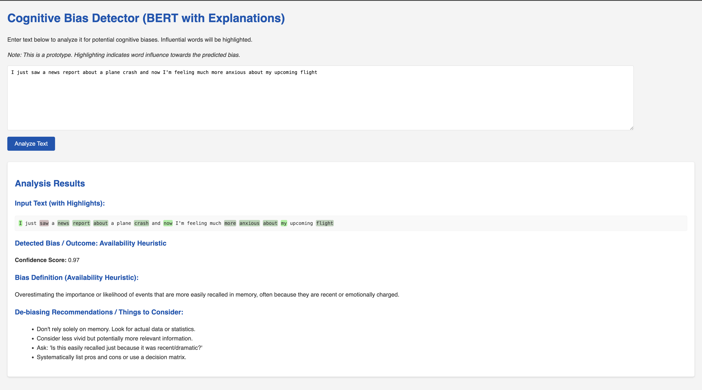
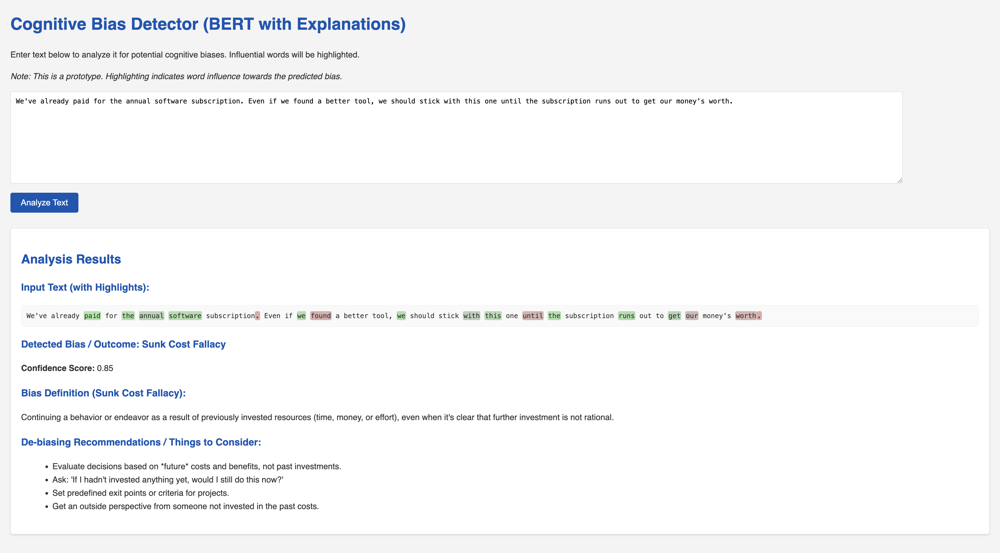
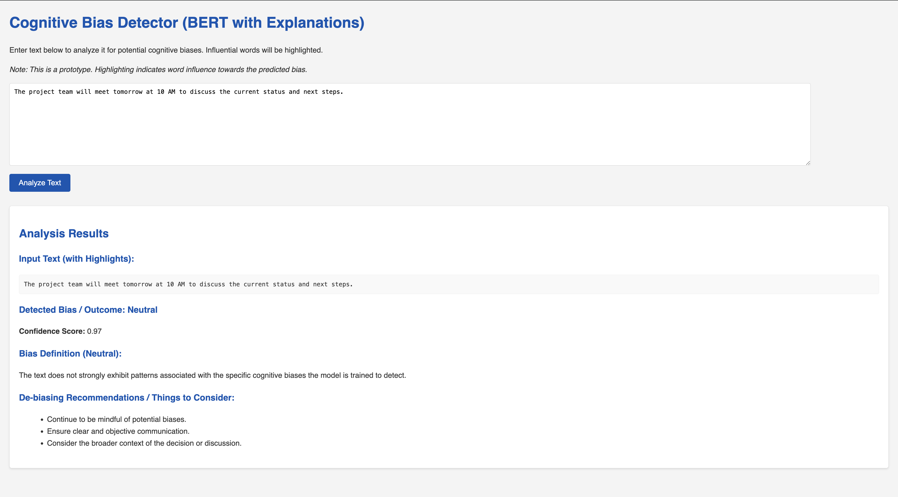

# Cognitive Bias Detector (Fine-tuned BERT with Explanations)

This project implements an AI-powered tool to detect potential cognitive biases in text. It utilizes a fine-tuned BERT model for classification and provides explanations by highlighting influential words in the input text.

## Features

*   **Bias Detection:** Identifies potential instances of common cognitive biases:
    *   Confirmation Bias
    *   Anchoring Bias
    *   Availability Heuristic
    *   Sunk Cost Fallacy
    *   (And a "Neutral" class for text not strongly exhibiting these biases)
*   **BERT-Powered Classification:** Uses a `bert-base-uncased` model fine-tuned on synthetically generated, bias-specific text data.
*   **Explainable AI (XAI):** Highlights words/phrases in the input text that contributed most to the model's prediction using word attributions from the `transformers-interpret` library.
*   **Bias Information:** Provides definitions and de-biasing recommendations for detected biases.
*   **Web Interface:** A simple Flask web application for easy interaction.

## Why This Project?

Cognitive biases are systematic patterns of deviation from norm or rationality in judgment. They can lead to perceptual distortion, inaccurate judgment, illogical interpretation, or what is broadly called irrationality, impacting decision-making in various aspects of life and work. This tool aims to:
1.  Increase awareness of potential biases in written communication.
2.  Provide a starting point for users to reflect on their reasoning.
3.  Showcase an application of NLP and Explainable AI to a nuanced human behavior.

## Technologies Used

*   **Backend:** Python, Flask
*   **Machine Learning:**
    *   Hugging Face `transformers` (for BERT model and pipeline)
    *   PyTorch (as the backend for `transformers`)
    *   `datasets` (for handling data during training)
    *   `scikit-learn` (for metrics, data splitting)
*   **Explainability:** `transformers-interpret`
*   **Data Generation:** Custom Python scripts
*   **Frontend:** HTML, CSS (basic styling)
*   **Dependency Management:** `pip` and `requirements.txt`

## Setup and Installation

**Prerequisites:**
*   Python 3.9 or higher
*   `pip` package installer
*   (Recommended) A virtual environment manager (e.g., `venv`)

**Steps:**

1.  **Clone the repository:**
    ```bash
    git clone https://github.com/<your-github-username>/<your-repo-name>.git
    cd <your-repo-name>
    ```

2.  **Create and activate a virtual environment (recommended):**
    ```bash
    python3 -m venv venv
    source venv/bin/activate  # On macOS/Linux
    # venv\Scripts\activate    # On Windows
    ```

3.  **Install dependencies:**
    ```bash
    pip install -r requirements.txt
    ```
    *(This may take some time as it includes PyTorch and Transformers.)*

4.  **Generate Synthetic Training Data:**
    The model is trained on synthetic data. To generate it:
    ```bash
    python synthetic_data_generator.py
    ```
    This will create `generated_bias_data.csv`.

5.  **Train the BERT Model:**
    This step fine-tunes the `bert-base-uncased` model on the generated data.
    **Note:** This is computationally intensive and will take a significant amount of time, especially without a GPU.
    ```bash
    python train_transformer.py
    ```
    The fine-tuned model will be saved in the `fine_tuned_bert_model/` directory.
    *(If you have a pre-trained model, you can skip this step and place your model files in the `fine_tuned_bert_model/` directory.)*

6.  **Run the Flask Web Application:**
    ```bash
    python app.py
    ```
    The application will typically be available at `http://127.0.0.1:5000/`.

## Usage

1.  Open your web browser and navigate to the address provided when you run `app.py` (usually `http://127.0.0.1:5000/`).
2.  Paste the text you want to analyze into the text area.
3.  Click the "Analyze Text" button.
4.  The results will display:
    *   The input text with influential words highlighted.
    *   The detected cognitive bias (or "Neutral").
    *   The model's confidence score for the prediction.
    *   A definition of the detected bias.
    *   Recommendations for de-biasing or further consideration.

## Model Details

*   **Base Model:** `bert-base-uncased` from Hugging Face.
*   **Training Data:** Synthetically generated text examples for each target bias and a "Neutral" class. The quality and diversity of this data significantly impact model performance.
*   **Fine-tuning:** The model is fine-tuned for sequence classification on the custom dataset.
*   **Explainability:** Word attributions are generated using the `SequenceClassificationExplainer` from the `transformers-interpret` library, which typically employs methods like Integrated Gradients or similar for BERT.

## Limitations and Future Work

*   **Synthetic Data:** The model's understanding is limited by the synthetic data it was trained on. It may not generalize perfectly to all real-world phrasing or subtle biases.
*   **Limited Bias Coverage:** Currently detects a small set of biases. Expanding this set would require more data and model retraining.
*   **Context Sensitivity:** The model analyzes the provided text in isolation and lacks broader conversational or situational context.
*   **Interpretability Nuances:** Word highlighting provides insights but is an approximation of the model's internal reasoning.
*   **Subjectivity:** Bias detection can be subjective. This tool is an aid, not a definitive arbiter.

**Potential Future Enhancements:**

*   [ ] **Collect and Annotate Real-World Data:** Improve model robustness with more diverse and realistic training examples.
*   [ ] **Expand Bias Lexicon:** Add more types of cognitive biases.
*   [ ] **User Feedback Loop:** Allow users to provide feedback on predictions to help refine the model or data.
*   [ ] **Advanced Highlighting:** More sophisticated token-to-word alignment for highlighting.
*   [ ] **Alternative Explanation Methods:** Explore and integrate other XAI techniques.
*   [ ] **Integration with other platforms:** (e.g., browser extension, document editor plugin).
*   [ ] **Quantitative Evaluation:** More rigorous evaluation on a dedicated, unseen test set of (ideally) human-annotated data.

---

Here's a look at the Cognitive Bias Detector in action:





